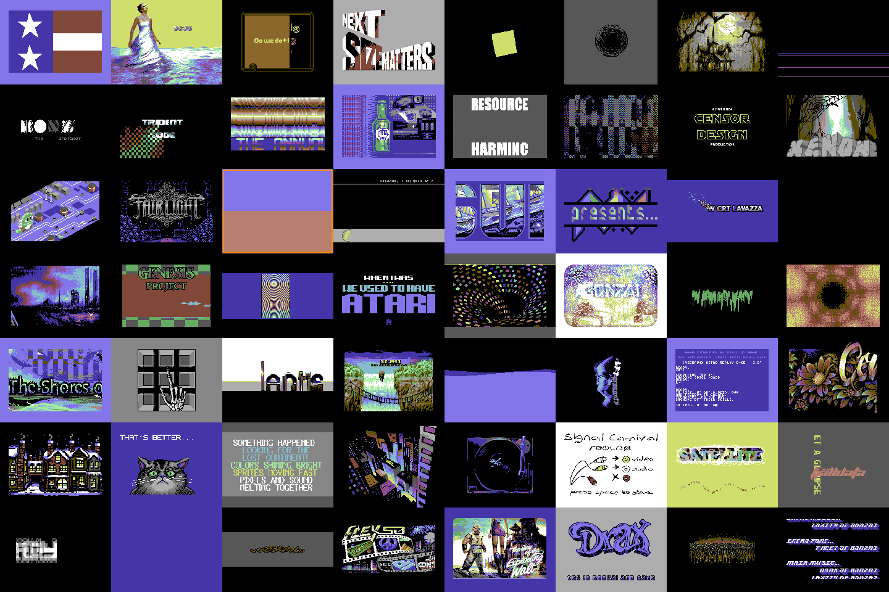
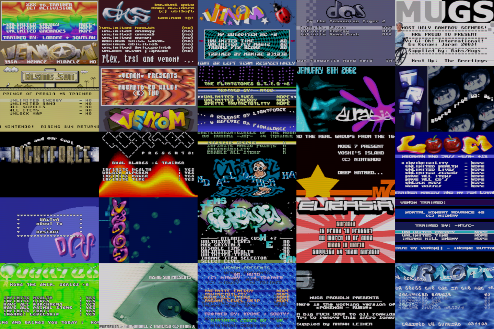

## demarc

An command line emulator frontend for the demoscene



*Main goal*

Make it easy to watch demos on your PC through emulation

* Runs oldskool demos using emulator cores
* Runs Windows demos through Wine (Linux only)
* Shows images and plays music
* Runs multiple demos in order or shuffled
* Indexes Demozoo/Pouet and CSDb
* Fuzzy search
* Shows demo meta data as overlay
* CRT filter for "authentic" look (using Timothy Lottes shader)
* Right-Alt hotkey for disk switch etc

### Platforms

C64, Amiga, Atari ST, Amstrad CPC, C16, ZX Spectrum, Megadrive, SNES, Atari 2600, Atari XL, Tic-80, Pico-8, Playstation, Gameboy (Color), Gameboy Advance, Neo Geo, PC (DOS, and Windows through wine)

### Graphics Format Support

* **Standard**: `PNG`, `JPEG`, `TIF`, `GIF`, `TGA`, `PCX`
* **Amiga/PC**: IFF (`ILBM`, `ACBM`, `PBM`, Impulse `RGB`) including `HAM`/`HAM8` and dynamic palette (`SHAM`,`CTBL`,`BEAM`)
* **Atari**: Degas (`PIx`, `PCx`), Neo Chrome (`NEO`), Crack Art (`CA2`), Fullscreen Construction Kit (`KID`)
* **ZX Spectrum** (`SCR`)
* Color Cycling

### Music Format Support

* **C64** (sid)
* **Trackers** (mod, xm, s3m, ft, stm, it)
* **Atari** (snd, sndh, sap)
* **Consoles** (nsf, gbs, spc, psf)
* **Streaming** (mp3, flac)
* **PC** (v2m)
* **Spectrum** (emul, vtx, pt1, pt2, pt3, asc, sqt, stc, stp, psc)
* **Amiga** (smod, dm2, ahx, aon, mt2, mon, dw, fred, smod, hip, cus, fc, hvl, cm, fp, syn, ma, hipc, ml, mk2, bd, dln, 669, jam, dbm, bp, bp3, hes, lds)

## INSTALL

Pre-built binaries for Linux (x86_64), Windows (x86_64) and macOS (arm64) are
attached to every [release](https://github.com/sasq64/demarc/releases/latest).

Emulator cores are downloaded from the on first use, so the binary is all you need (except *Wine*, see below).

### Linux/macOS

```sh
curl --proto '=https' --tlsv1.2 -LsSf https://github.com/sasq64/demarc/releases/latest/download/demarc-installer.sh | sh
```

### Windows

*IMPORTANT:* Demarc downloads and links DLLs at runtime, which often makes Windows flag it as malware and silently delete it. Add an exception to your settings, or switch to a sane operating system.

`powershell -ExecutionPolicy Bypass -c "irm https://github.com/sasq64/demarc/releases/download/v1.4.0/demarc-installer.ps1 | iex"`

The above is often blocked by Windows security. You can try downloading the ps1 script manually and executing it:

```powershell
irm https://github.com/sasq64/demarc/releases/latest/download/demarc-installer.ps1 -OutFile "$env:TEMP\demarc-installer.ps1"
powershell -ExecutionPolicy Bypass -File "$env:TEMP\demarc-installer.ps1"
```

Or download the release zip: [demarc-x86_64-pc-windows-msvc.zip](https://github.com/sasq64/demarc/releases/download/v1.4.0/demarc-x86_64-pc-windows-msvc.zip)

## RUNNING

```bash
demarc Downloads/cool_group-new_demo.lha
demarc --db demozoo.tzt.gz --sort=rank --select
```

Database files can be found for each release (Assets)

*Or here:*

* [demozoo](https://minnberg.se/dl/demozoo.txt.gz)
* [csdb](https://minnberg.se/dl/csdb.txt.gz)

## USING WINE (LINUX ONLY)

* Install wine (latest version)
* Install bubblewrap and cabextract (for winetricks)
* Run wine-prefix setup script [scripts/mk_wine_prefix.sh](scripts/mk_wine_prefix.sh)

Use `demarc --check-wine` to see if requirements are met.

## BUILD

You need *rust*.

`cargo build --release`

On Linux the ALSA and udev headers are also needed
(`libasound2-dev libudev-dev` on Debian/Ubuntu).

## RUN

`cargo run -- <files>`

or

`target/release/demarc <files>`

## SHORTCUTS

*Right Alt* / *Right Ctrl* +

```
O = Open fuzzy search
D = Swap disk
SPACE or N = Next file
P = Previous file
S = Change scaling
I = Toggle Info
T = Screenshot
SHIFT+T = Screenshot All
U = Pause/Resume
R = Reset
C = Toggle CRT filter
W/SHIFT-W = Warp 10s/30s
J = Toggle Joystick/keyboard
Z = Shader Settings

For grid:

TAB = Next emulator
SHIFT+TAB = Previous emulator
ENTER = Maximize/Unmaximize
A = Select all emulators
SHIFT+N = Next file in all emulators

```

## More screenshots



